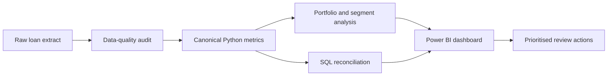
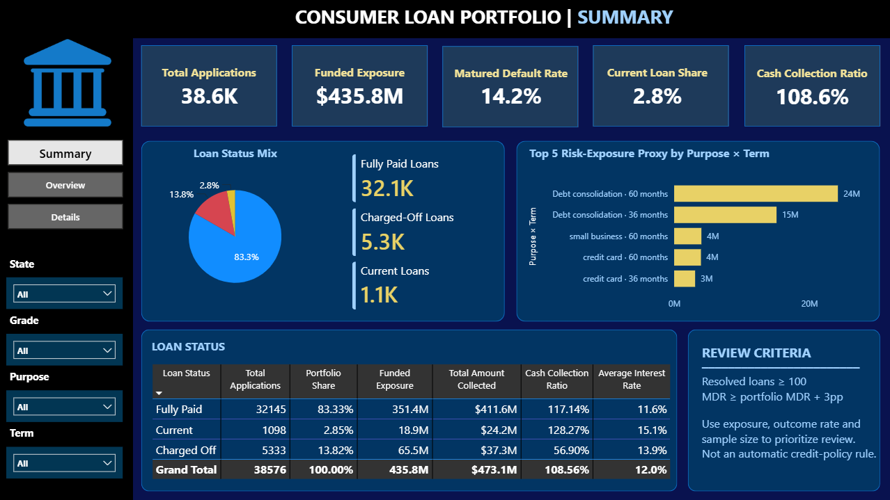
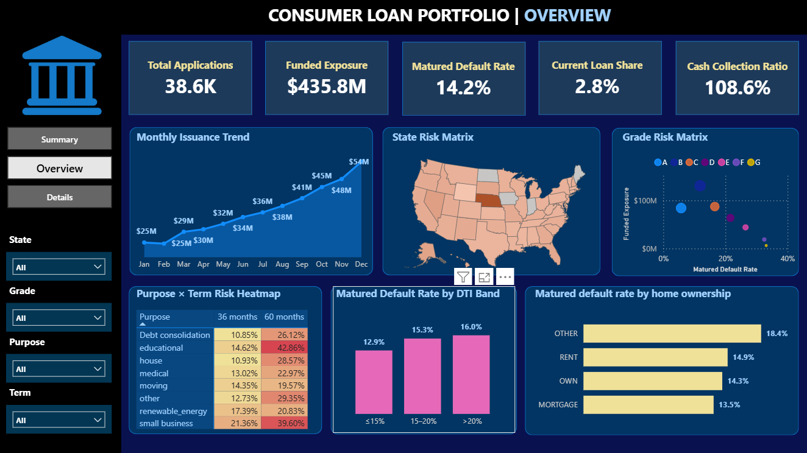
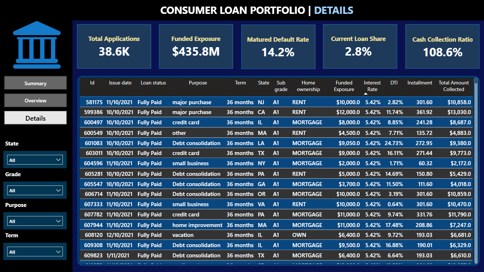

# Bank Loan Portfolio Risk Analytics

<p align="center">
  <strong>From raw lending data to an auditable portfolio-risk decision framework</strong>
</p>

<p align="center">
  <a href="https://www.python.org/"></a>
  <a href="https://pandas.pydata.org/"></a>
  <a href="https://powerbi.microsoft.com/"></a>
  <a href="https://www.microsoft.com/sql-server"></a>
  <a href="LICENSE"></a>
</p>

This project analyses **38,576 consumer loans issued in 2021** to help Credit Risk and Portfolio teams identify segments that warrant deeper review. It combines Python, SQL Server, and Power BI in a governed workflow built around three decision signals: **observed outcome risk, funded exposure, and sample-size reliability**.

> The analysis is retrospective and descriptive. It is not a credit-scoring model, an automated approval policy, or a causal study.

**[Dashboard](#dashboard)** · **[Key findings](#key-findings)** · **[Methodology](#methodology)** · **[Run locally](#run-the-project)** · **[Documentation](#primary-deliverables)**

---

## Project Overview

| Item | Description |
|---|---|
| **Business question** | Which portfolio segments should be prioritised for risk review? |
| **Decision audience** | Credit Risk Manager, Portfolio Manager, Underwriting Lead |
| **Dataset** | 38,576 unique consumer-loan records issued during 2021 |
| **Primary outcome** | Matured default rate: `Charged Off / (Charged Off + Fully Paid)` |
| **Primary deliverable** | Three-page interactive Power BI dashboard |
| **Analytical controls** | Metric contract, data-quality tests, confidence intervals, and cross-tool reconciliation |

### Analytical Workflow



---

## Dashboard

The Power BI report turns the analytical outputs into a three-page review workflow. Use the **State, Grade, Purpose, and Term** slicers to move from portfolio-level monitoring to individual-loan investigation.

[Download the Power BI report](dashboard/Bank_loan.pbix)

### 1. Executive Summary

Portfolio scale, status mix, headline KPIs, the highest risk-exposure segments, and the criteria used to prioritise a review.

[](dashboard/summary.png)

### 2. Portfolio Overview

Monthly origination, geographic and grade risk matrices, a purpose-by-term heatmap, and borrower-segment comparisons.

[](dashboard/overview.png)

### 3. Loan Details

A filterable loan-level table for investigating the records behind portfolio and segment signals.

[](dashboard/details.png)

> Open `dashboard/Bank_loan.pbix` in Power BI Desktop and refresh the model after placing the source CSV at the expected local path.

---

## Key Findings

| Role | Finding | Evidence | Decision use |
|---|---|---|---|
| **P0 · Headline risk** | **Debt consolidation · 60 months** | $92.8M exposure, 26.1% matured default rate, resolved `n=4,824`; the 60-month rate also exceeds the 36-month rate within Grades A–F | Prioritise a grade-controlled policy and pricing backtest; do not automatically restrict the segment |
| **P1 · Opportunity hypothesis** | **Grade A exposure gap** | Lowest observed matured default rate (5.7%), yet $84.3M exposure is below Grade B ($130.7M) and Grade C ($87.5M); average loan size is only $8.7K | Investigate demand, approval mix, loan-size constraints, pricing, and risk-adjusted return before changing allocation |
| **P1 · Risk monitoring** | **Florida** | $30.0M exposure and 17.8% matured default rate; approximately +3.75 pp above the rate expected from its grade mix | Add a state-risk alert and investigate term, purpose, and borrower mix; geography is not assumed causal |
| **P2 · Concentration monitoring** | **California** | Largest state exposure at $78.5M (18.0% of portfolio funding); 15.7% matured default rate and only about +1.18 pp above its grade-mix expectation | Monitor concentration rather than treating California as an abnormal credit-risk segment |
| **Supporting guardrail** | **DTI above 20%** | $84.0M exposure and 16.2% matured default rate; approximately +1.28 pp above its grade-mix expectation | Retain as a monitoring variable; do not impose a hard DTI cutoff from this analysis |

The portfolio benchmark is a **14.23% matured default rate across 37,478 resolved loans**. Grade A has the lowest observed matured default rate, yet its $84.3M exposure is below Grade B ($130.7M) and Grade C ($87.5M). The comparison with Grade C is particularly notable: Grade A has more loans (9,689 vs. 7,904) but a smaller average loan amount ($8.7K vs. $11.1K), which more than offsets its higher loan count. This is an allocation hypothesis—not evidence that Grade A lending should automatically be expanded.

The hierarchy deliberately separates a decision-driving insight from useful monitoring context. The strongest immediate review candidate remains the 60-month debt-consolidation segment because it combines material exposure, an elevated outcome rate, cross-grade persistence, and a sufficiently large resolved-loan denominator. Grade A is a secondary opportunity hypothesis; Florida, California, and DTI are monitoring signals with different operational roles.

For evidence, limitations, and prioritised next steps, see the [Executive Summary](report/executive_summary.md).

---

## Portfolio Snapshot

| KPI | Value | Interpretation |
|---|---:|---|
| Total applications | 38,576 | Unique loan IDs in the supplied snapshot |
| Funded exposure | $435,757,075 | Capital funded; not outstanding balance |
| Resolved loans | 37,478 | `Fully Paid` plus `Charged Off` |
| Matured default rate | 14.23% | Primary outcome KPI; excludes unresolved loans |
| Current-loan share | 2.85% | Unresolved loans retained in scale metrics only |
| Cash collection ratio | 108.56% | Payments divided by funded exposure; not profit or ROI |
| Average interest rate | 12.05% | Descriptive pricing diagnostic |
| Average DTI | 13.33% | Portfolio borrower-capacity diagnostic |

---

## Methodology

### Outcome Taxonomy

| Loan status | Analytical treatment |
|---|---|
| `Fully Paid` | Resolved positive outcome |
| `Charged Off` | Resolved adverse outcome |
| `Current` | Unresolved; included in scale and exposure metrics, excluded from matured outcome rates |

### Review-Priority Framework

A segment is not prioritised on its default rate alone. Every candidate is assessed using:

- funded exposure and portfolio exposure share;
- resolved-loan count for denominator transparency;
- matured default rate with a 95% Wilson confidence interval;
- difference from the portfolio benchmark in percentage points;
- a descriptive risk-exposure proxy: `funded exposure × matured default rate`;
- a monitoring or review recommendation, never an automatic decision rule.

### Scope Boundaries

This project does **not** estimate:

- probability of default for a new applicant;
- expected loss, realised loss, recovery, or profitability;
- the causal effect of grade, term, purpose, DTI, or geography;
- an approval, decline, or pricing policy.

---

## Data Quality and Governance

The reusable audit pipeline in [`src/data_quality.py`](src/data_quality.py) checks data grain, key uniqueness, required fields, ranges, date parsing, and the status taxonomy before analysis. The core automated guardrails pass.

| Finding | Analytical impact | Treatment |
|---|---|---|
| `emp_title`: 1,438 missing values (3.73%) | Low; optional attribute | Display as `Unknown` and retain a missingness flag |
| `term`: leading whitespace in all rows | Can split groups incorrectly | Trimmed in canonical Python and SQL logic |
| `annual_income`: 1,824 IQR-fence outliers | Can pull the mean upward | Retained; median preferred in segment comparisons |
| 15,453 rows where `last_payment_date < issue_date` | Invalidates payment-timing analysis | Field quarantined from timing analysis |
| 20,182 rows where `last_credit_pull_date < issue_date` | Invalidates chronology features | Field quarantined from chronology analysis |
| All 37,478 resolved loans have `next_payment_date` | Status/date inconsistency | Retained as a documented warning |

`issue_date` is approved for origination trends. Payment and credit-pull dates remain quarantined until their source semantics are verified. See the [Data Provenance](docs/data_provenance.md), [Data Dictionary](docs/data_dictionary.md), and [Metric Contract](docs/metric_contract.md).

---

## Technology Stack

| Layer | Technology | Purpose |
|---|---|---|
| Analysis | Python, Pandas, NumPy | Canonical KPIs, quality checks, and segment analysis |
| Visualisation | Matplotlib, Seaborn, Plotly | Exploratory and statistical views |
| Dashboard | Power BI, DAX | Interactive portfolio monitoring and drill-down |
| Database | SQL Server, T-SQL | Independent KPI reproduction and reconciliation |
| Testing | `unittest`, validation scripts | KPI baselines and data-quality guardrails |
| Governance | Markdown documentation | Definitions, scope, lineage, and limitations |

---

## Repository Structure

```text
Bank_loan_project/
├── data/
│   └── financial_loan.csv              # Source extract: 38,576 loan records
├── dashboard/
│   ├── Bank_loan.pbix                  # Interactive Power BI report
│   ├── summary.png
│   ├── overview.png
│   └── details.png
├── docs/                               # Scope, metrics, DAX, lineage, dictionary
├── notebooks/
│   ├── 01_data_quality.ipynb
│   ├── 02_portfolio_eda.ipynb
│   ├── bank_loan_report.ipynb
│   └── legacy/
├── report/                             # Problem statement and executive summary
├── scripts/                            # Notebook refactor and project validation
├── src/                                # Reusable data-quality and risk-metric logic
├── tests/                              # Automated data and KPI tests
├── Query.sql                           # SQL Server analysis and reconciliation
├── pyproject.toml
└── requirements.txt
```

---

## Run the Project

### 1. Create the environment

```bash
python -m venv .venv
```

Windows PowerShell:

```powershell
.venv\Scripts\Activate.ps1
python -m pip install --upgrade pip
python -m pip install -r requirements.txt
```

macOS or Linux:

```bash
source .venv/bin/activate
python -m pip install --upgrade pip
python -m pip install -r requirements.txt
```

### 2. Run validation

```bash
python scripts/validate_project.py
```

The validator checks required files, KPI baselines, notebook structure, SQL contract terms, data-quality rules, and automated reconciliation tests.

### 3. Execute the notebooks

```bash
python -m jupyter nbconvert --execute --to notebook --inplace notebooks/01_data_quality.ipynb
python -m jupyter nbconvert --execute --to notebook --inplace notebooks/02_portfolio_eda.ipynb
python -m jupyter nbconvert --execute --to notebook --inplace notebooks/bank_loan_report.ipynb
```

### 4. Reconcile SQL and refresh Power BI

1. Load `data/financial_loan.csv` into SQL Server as `dbo.bank_loan_data`.
2. Run [`Query.sql`](Query.sql). Every difference field in Section 9 should equal zero.
3. Open [`dashboard/Bank_loan.pbix`](dashboard/Bank_loan.pbix), update the CSV source path if required, and refresh the model.

---

## Primary Deliverables

| Deliverable | Description |
|---|---|
| [Power BI Dashboard](dashboard/Bank_loan.pbix) | Three-page interactive report: Summary, Overview, and Details |
| [Risk Analyst Notebook](notebooks/bank_loan_report.ipynb) | Canonical portfolio KPI and segment analysis |
| [Portfolio EDA](notebooks/02_portfolio_eda.ipynb) | Confidence intervals and grade, state, purpose, term, DTI, and vintage views |
| [Executive Summary](report/executive_summary.md) | Prioritised review actions with evidence and caveats |
| [SQL Analysis](Query.sql) | Ten-section T-SQL analysis with reconciliation checks |
| [Metric Contract](docs/metric_contract.md) | Source-of-truth KPI definitions |
| [Data Quality Audit](notebooks/01_data_quality.ipynb) | Reproducible data-quality assessment |

---

## Limitations

- The dataset provider, extraction date, status observation date, and refresh cadence are not documented.
- Results are descriptive associations and may be confounded by portfolio composition.
- Expected loss and profitability require loss-given-default, recovery timing, cost of funds, and demand data that are not available.
- A cash collection ratio above 100% reflects interest-inclusive payments; it does not establish net profitability.
- The MIT license covers project code and documentation, not the supplied dataset or third-party assets.
- Do not redistribute the source CSV until its usage rights are verified.

---

## License

Project code and documentation are available under the [MIT License](LICENSE). Dataset and third-party asset rights remain subject to the [provenance register](docs/data_provenance.md).
